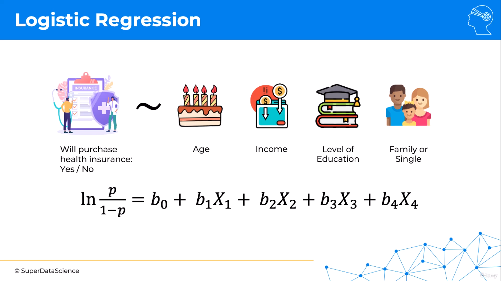
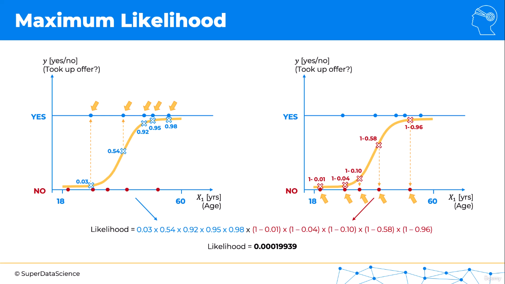
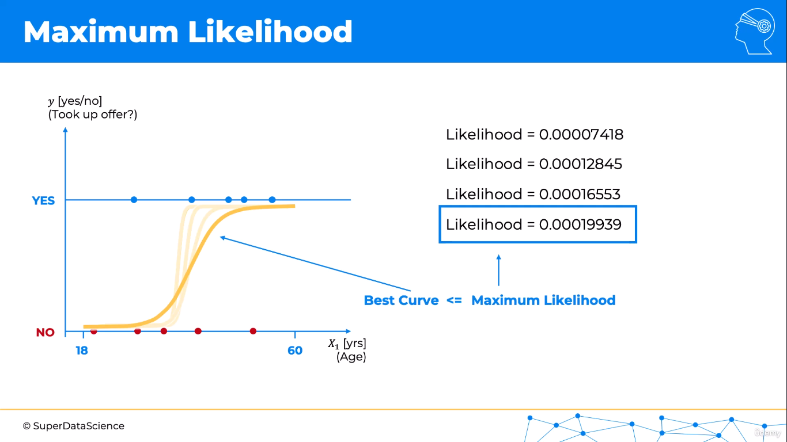
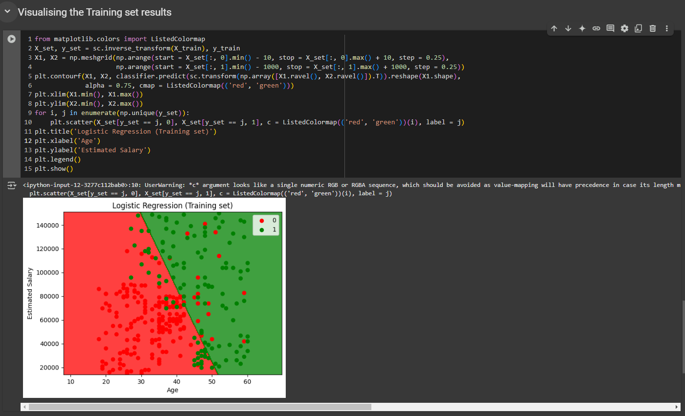
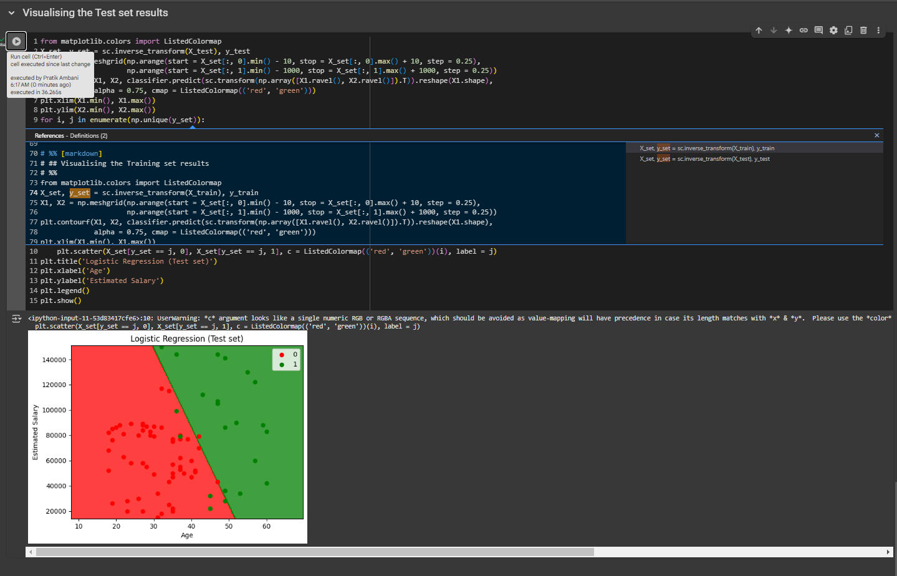
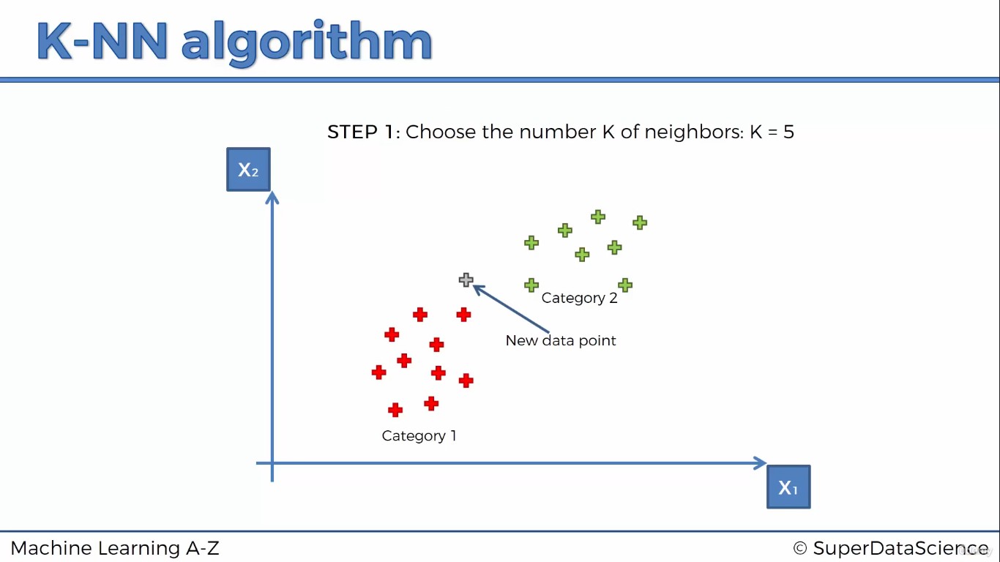
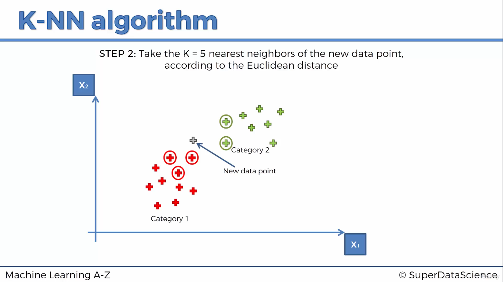
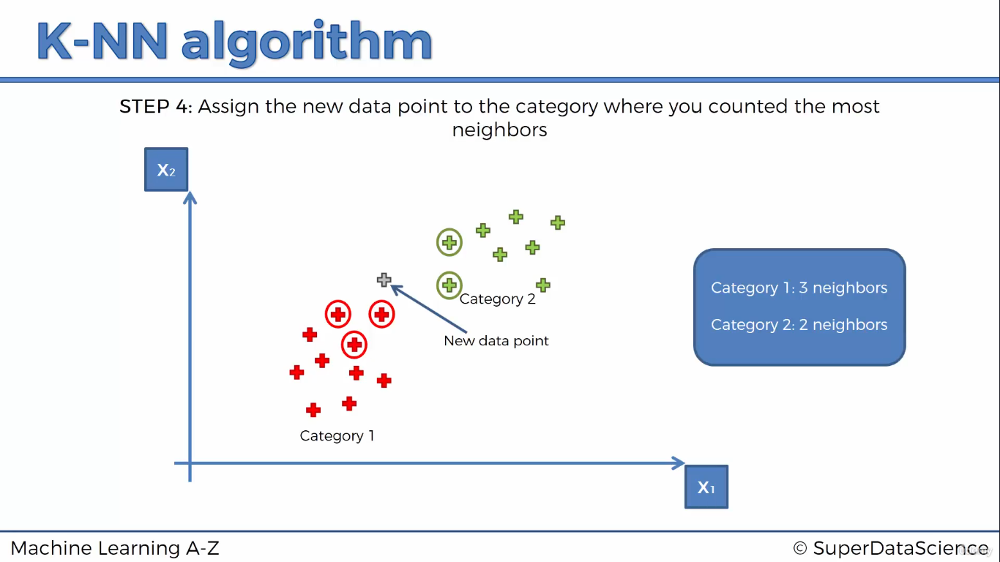
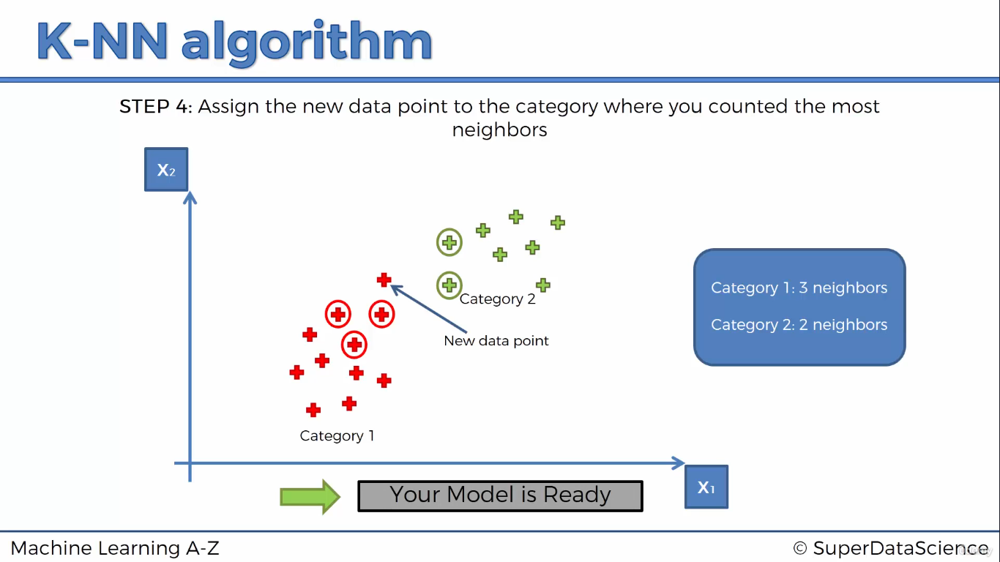

# Machine Learning A-Z™: Hands-On Python & R In Data Science

**Course URL:** [Udemy Course](https://www.udemy.com/course/machinelearning)

**Course Details:**

- 45 sections
- 311 lectures
- 44h 21m total length

**Resources:**
You will find all the resources (codes, datasets, and slides) of our Machine Learning A-Z course right here:
[SuperDataScience Resources](https://www.superdatascience.com/pages/machine-learning)

**GPT Prompts:**

- [YouTube Video](https://www.youtube.com/watch?v=Bw7pAYv6iaM)
- [Google Drive Folder](https://drive.google.com/drive/u/0/folders/1ShVWcucf7f3cFe4zNbkwqUqpf_8HkgWZ)

# Section 15: Part 3 - Classification

## 142. Welcome to Part 3 - Classification

Unlike regression where you predict a continuous number, you use classification to predict a category. There is a wide variety of classification applications from medicine to marketing. Classification models include linear models like Logistic Regression, SVM, and nonlinear ones like K-NN, Kernel SVM, and Random Forests.

### Machine Learning Classification Models

- Logistic Regression
- K-Nearest Neighbors (K-NN)
- Support Vector Machine (SVM)
- Kernel SVM
- Naive Bayes
- Decision Tree Classification
- Random Forest Classification

## 143. What is Classification in Machine Learning? Fundamentals and Applications

**Definition:** A Machine Learning technique to identify the category of new observations based on training data. Different than regression where we predict a number. Here we identify the category. It is a type of supervised machine learning.

### Use Cases

- Medicine
- Marketing
- Businesses

### Examples

- Which customers are likely to leave
- Email categorization
- Image recognition (e.g., dogs or cats)

# Section 16: Logistic Regression

## 144. Understanding Logistic Regression: Predicting Categorical Outcomes


Difference from regression in classification is that we have only yes and no in y-axis.
Equation as per image above:

- p is probability


### LR Curve

- Also called sigmoid curve
- Based on data how it will apply
- Find where they fit between x and y based on probability
  - Ex. For 35 years old: 42% chances are there
  - For 45 years old: 81% chances are there
- Most of the times we'll get binary output: Less than 50% or greater than 50%

### Equation when there are more parameters



## 145. Logistic Regression: Finding the Best Fit Curve Using Maximum Likelihood

How do we know which is the best curve? ==> By calculating maximum likelihood

Prediction will be between 0 to 1

- Ex: 0.01, 0.04, 0.10, 0.58% chances, etc.
- These are the probabilities of somebody saying yes
- So probability of them saying no is 1 minus above

Now we need to calculate likelihood, multiply the numbers shown below



To find the best fitting curve:

- Compare likelihood of different curves



## 146. Step 1a - Building a Logistic Regression Model for Customer Behavior Prediction

Code - Part 3 - Classification - Section 14

<!-- Case Study: Tumour is benign or malignant -->

New SUV is launched in your company
Which of previous customers will buy a newly launched SUV?

### Social_Network_Ads.csv

- Age
- Estimated Salary
- Purchased

## 147. Step 1b - Implementing Logistic Regression in Python: Data Preprocessing Guide

Explain logistic regression like I'm five
ChatGPT said:
ChatGPT
Alright! Imagine you have a magical yes/no machine that helps you decide if you should take an umbrella outside. 🌧️☀️

👉 If it’s super cloudy – the machine says "YES, take an umbrella!"
👉 If it’s sunny – the machine says "NO, don’t take an umbrella!"

But what if the weather is partly cloudy? 🤔
Instead of just saying yes or no, the machine gives you a probability:

- 80% chance of rain? → Probably take an umbrella!
- 20% chance of rain? → Probably don’t!

🔹 Logistic Regression is like this yes/no machine. It looks at the information (like weather conditions) and predicts a probability between 0 and 1 (0% to 100%).

💡 If the probability is above 50%, it predicts YES (1).
💡 If the probability is below 50%, it predicts NO (0).

### Math Magic Behind It (Super Simple Version)

Logistic regression uses an equation like linear regression, but instead of predicting any number, it squeezes the result between 0 and 1 using a special curve called the sigmoid function:

\[ \text{Probability} = \frac{1}{1 + e^{-(mx + b)}} \]

(Just think of it as a formula that turns numbers into probabilities 📉📈)

### Real-World Example

- ✅ Will a person buy a car? (Yes/No) → Based on age, salary, etc.
- ✅ Will a student pass an exam? (Yes/No) → Based on study hours, attendance, etc.
- ✅ Is an email spam? (Yes/No) → Based on words in the email.

So, Logistic Regression is just a smart yes/no machine that makes decisions based on numbers. 🧠⚡

### Logistic Regression Steps

1. Importing the libraries
2. Importing the dataset
3. Splitting the dataset into the Training set and Test set
4. Feature Scaling
5. Training the Logistic Regression model on the Training set
6. Predicting a new result
7. Predicting the Test set results
8. Making the Confusion Matrix
9. Visualising the Training set results
10. Visualising the Test set results

### Navigate to Logistic Regression codebase

#### Importing the libraries

```python
import numpy as np
import matplotlib.pyplot as plt
import pandas as pd
```

## 150. Step 3a - How to Import and Use LogisticRegression Class from Scikit-learn

    sklearn documentation: https://scikit-learn.org/stable/api/index.html
        https://scikit-learn.org/stable/api/sklearn.linear_model.html#module-sklearn.linear_model
        https://scikit-learn.org/stable/modules/generated/sklearn.linear_model.LogisticRegression.html#sklearn.linear_model.LogisticRegression

## 151. Step 3b - Training Logistic Regression Model: Fit Method for Classification

    Training the Logistic Regression model on the Training set
        from sklearn.linear_model import LogisticRegression
        classifier = LogisticRegression(random_state = 0)
        classifier.fit(X_train, y_train)

## 152. Step 4a - Formatting Single Observation Input for Logistic Regression Predict

    Predicting a new result
        classifier.predict([[30, 87]])   

        but scale it,
        classifier.predict(sc.transform([[30,87000]])
        classifier.predict(sc.transform([[30,87000]]))
)

## 153. Step 4b: Predicted vs. Real Purchase Decisions in Logistic Regression

    Format: classifier.predict(sc.transform([[30,870000]]))

## 154. Step 5 - Comparing Predicted vs Real Results: Python Logistic Regression Guide

    Predicting the Test set results
        Same as multiple linear regressions
    y_pred = classifier.predict(X_test)
    np.set_printoptions(precision = 2) # upto 2 decimals
    print(np.concatenate( (y_pred.reshape(len(y_pred), 1), y_test.reshape(len(y_test), 1)), 1 ))

    [[0 0]
    [0 0]
    [0 0]
    [0 0]
    [0 0]
    [0 0]
    [0 0]
    [1 1]
    [0 0]
    [0 0]
    [0 0]
    [0 0]
    [0 0]
    [0 0]
    [0 0]
    [0 0]
    [0 0]
    [0 0]
    [1 1]
    [0 0]
    [0 0]
    [1 1]
    [0 0]
    [1 1]
    [0 0]
    [1 1]
    [0 0]
    [0 0]
    [0 0]
    [0 0]
    [0 0]
    [0 1]
    [1 1]
    [0 0]
    [0 0]
    [0 0]
    [0 0]
    [0 0]
    [0 0]
    [1 1]
    [0 0]
    [0 0]
    [0 0]
    [0 0]
    [1 1]
    [0 0]
    [0 0]
    [1 1]
    [0 0]
    [1 1]
    [1 1]
    [0 0]
    [0 0]
    [0 0]
    [1 1]
    [0 1]
    [0 0]
    [0 0]
    [0 1]
    [0 0]
    [0 0]
    [1 1]
    [0 0]
    [0 1]
    [0 0]
    [1 1]
    [0 0]
    [0 0]
    [0 0]
    [0 0]
    [1 1]
    [0 0]
    [0 0]
    [0 1]
    [0 0]
    [0 0]
    [1 0]
    [0 0]
    [1 1]
    [1 1]]

## 155. Step 6a - Implementing Confusion Matrix and Accuracy Score in Scikit-Learn

    Making the Confusion Matrix
        A 2d matrix to idenfity what went right and what went wrong
        We Compute confusion matrix to evaluate the accuracy of a classification.

        from sklearn.metrics import confusion_matrix, accuracy_score
        confusion_matrix(y_test, y_pred)

## 156. Step 6b: Evaluating Classification Models - Confusion Matrix & Accuracy Metrics

    from sklearn.metrics import confusion_matrix, accuracy_score
    cm = confusion_matrix(y_test, y_pred)
    print(cm)
    accuracy_score(y_test, y_pred)
    Output:
    [[57  1]
    [ 5 17]]
    0.925

    57 - didn't buy ==> Correct
    17 - bought ==> Correct
    1 - didn't buy ==> Incorrect
    5 - bought ==> Incorrect
    92.5% correct predictions

## 157. Step 7a - Visualizing Logistic Regression Decision Boundaries in Python: 2D Plot

        How logisstic refression classifies the observations in two sets: 0 and 1
        the curve that separates these two regions is called Classification 
        Curve

        2d plot
        X: age
        Y: estimated salary

        2 regions: cust bought subv and didn't
        
        We won't use this plot again ever coz dataset have many features so prediction region and prediction boundaries can be drawn in 2d plot

        Straight Line for Linear Models
        Non-Straight Line for Non-Linear Models

## 158. Step 7b - Interpreting Logistic Regression Results: Prediction Regions Explained

    Visualising the Training set results
        

    from matplotlib.colors import ListedColormap
    X_set, y_set = sc.inverse_transform(X_train), y_train
    X1, X2 = np.meshgrid(np.arange(start = X_set[:, 0].min() - 10, stop = X_set[:, 0].max() + 10, step = 0.25),
                        np.arange(start = X_set[:, 1].min() - 1000, stop = X_set[:, 1].max() + 1000, step = 0.25))
    plt.contourf(X1, X2, classifier.predict(sc.transform(np.array([X1.ravel(), X2.ravel()]).T)).reshape(X1.shape),
                alpha = 0.75, cmap = ListedColormap(('red', 'green')))
    plt.xlim(X1.min(), X1.max())
    plt.ylim(X2.min(), X2.max())
    for i, j in enumerate(np.unique(y_set)):
        plt.scatter(X_set[y_set == j, 0], X_set[y_set == j, 1], c = ListedColormap(('red', 'green'))(i), label = j)
    plt.title('Logistic Regression (Training set)')
    plt.xlabel('Age')
    plt.ylabel('Estimated Salary')
    plt.legend()
    plt.show()

## 159. Step 7c - Visualizing Logistic Regression Performance on New Data in Python

    Visualising the Test set results
        

    from matplotlib.colors import ListedColormap
    X_set, y_set = sc.inverse_transform(X_test), y_test
    X1, X2 = np.meshgrid(np.arange(start = X_set[:, 0].min() - 10, stop = X_set[:, 0].max() + 10, step = 0.25),
                        np.arange(start = X_set[:, 1].min() - 1000, stop = X_set[:, 1].max() + 1000, step = 0.25))
    plt.contourf(X1, X2, classifier.predict(sc.transform(np.array([X1.ravel(), X2.ravel()]).T)).reshape(X1.shape),
                alpha = 0.75, cmap = ListedColormap(('red', 'green')))
    plt.xlim(X1.min(), X1.max())
    plt.ylim(X2.min(), X2.max())
    for i, j in enumerate(np.unique(y_set)):
        plt.scatter(X_set[y_set == j, 0], X_set[y_set == j, 1], c = ListedColormap(('red', 'green'))(i), label = j)
    plt.title('Logistic Regression (Test set)')
    plt.xlabel('Age')
    plt.ylabel('Estimated Salary')
    plt.legend()
    plt.show()

    To minimixr the error we need to build a prediction line that is not a straight line

    This can be done with Non-Linear classifiers. To be covered later

## 160. Logistic Regression in Python - Step 7 (Colour-blind friendly image)

SKIPPED_R

## 161. Step 1 - Data Preprocessing for Logistic Regression in R: Preparing Your Dataset

SKIPPED_R

## 162. Step 2 - How to Create a Logistic Regression Classifier Using R's GLM Function

SKIPPED_R

## 163. Step 3 - How to Use R for Logistic Regression Prediction: Step-by-Step Guide

SKIPPED_R

## 164. Step 4 - How to Assess Model Accuracy Using a Confusion Matrix in R

SKIPPED_R

## 165. Warning - Update

SKIPPED_R

## 166. Step 5a - Interpreting Logistic Regression Plots: Prediction Regions Explained

SKIPPED_R

## 167. Step 5b: Logistic Regression - Linear Classifiers & Prediction Boundaries

SKIPPED_R

## 168. Step 5c - Data Viz in R: Colorizing Pixels for Logistic Regression

SKIPPED_R

## 169. Logistic Regression in R - Step 5 (Colour-blind friendly image)

SKIPPED_R

## 170. Optimizing R Scripts for Machine Learning: Building a Classification Template

SKIPPED_R

## 171. Machine Learning Regression and Classification EXTRA

Machine Learning Regression and Classification EXTRA
Are you having trouble mastering the basics of Regression and Classification?

Mastering these Machine Learning concepts is essential for any data scientist eyeing to succeed.

That’s exactly why we’ve created the 'Ultimate Guide to Regression and Classification' for anyone looking to learn or simply brush up on the principles behind these analysis concepts.

Here’s what’s covered inside:

Simple Linear Regression

Multiple Linear Regression

Logistic Regression

Click here to access the Ultimate Guide to Regression and Classification: <https://www.superdatascience.com/blogs/the-ultimate-guide-to-regression-classification>
<https://www.slideshare.net/slideshow/deep-learning-az-regression-classification-module-7/111051391>

# pending #TODO

## Quiz 9: Logistic Regression Quiz

- Logistic Regression is a linear classifier
- Using the formula for logistic regression, the line is seen as the best fit (similar to linear regression)
- Logistic Regression returns probabilities
- Probability represented by p_hat
- In our example from the intuition, if a person has a 27% probability (below 50) would they would be seen as taking the offer or not taking the offer? In this, it can help to think of the projected upwards or downwards functionality. ==> Not taking offer

## 172. EXTRA CONTENT: Logistic Regression Practical Case Study

EXTRA CONTENT: Logistic Regression Practical Case Study
Dear Students,

We hope that you have enjoyed the logistic regression section and we wanted to thank you for all of your feedback throughout the course. To thank you, and to help you on your journey in ML we are happy to share with you the following link to a free case study for Breast Cancer detection using Logistic Regression. You can access it here!

<https://www.udemy.com/course/logistic-regression-cancer-detection-case-study/?referralCode=7E62BC258B645C95D9F5>

# pending #todo

Case study for Breast Cancer detection using Logistic Regression. You can access it


# Section 17: K-Nearest Neighbors (K-NN)

## 173. K-Nearest Neighbors (KNN) Explained: A Beginner's Guide to Classification

### **Scenario**
There are **two categories** preset in the database (e.g., **RED** and **GREEN**).  
Now, we add a **new data point**.  

**Question:** Should we add it to the **RED** or **GREEN** category?  
KNN helps to determine this.

---

## **Simple Algorithm**
### **Steps:**

1. **Choose the number K of neighbors**  
   

2. **Take the K nearest neighbors of the new data point according to the Euclidean Distance**  
   

3. **Among these K neighbors, count the number of data points in each category**  
   

4. **Assign the new data point to the category where you counted the most neighbors**  
   - Model is ready! 🎉  
   

---

## **Euclidean Distance**  
The Euclidean Distance formula helps calculate the distance between points:  


---

## **KNN Like I'm 5**  
_No worries! Let me break it down even more simply. 😊_

### **Imagine You’re in a New School 🏫**  
🔹 You don’t know **which group of friends** to join.  
🔹 You look around and see **two groups**:  

- **Football kids** 🏈 (they wear jerseys)  
- **Book lovers** 📚 (they carry books)  

Now, what do you do? 🤔  

✅ You look at the **closest students** near you.  
✅ If most of them are **football kids**, you decide to sit with them.  
✅ If most of them are **book lovers**, you choose them instead!  

**That’s exactly how K-Nearest Neighbors (KNN) works!** 🚀  
